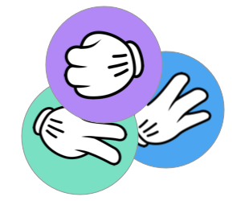

# HypeIsland



A secret project created for [LiveHacks #5](https://www.stagecast.io/livehacks/home).

## Websockets

Websockets are use for communication from the server to the clients.

```bash
wss://stagecast.se/api/events/{id}/ws
```

{id} is a well kept secret, only known by the inner circle.

## Tournament structure

A `Tournament` consists of multiple `Rounds` where players.

When a new `Tournament` is created (could be based on a new moment ID coming from the websocket stream),

## Rounds

A `Round` consists of multiple `Matches`.

## Matches

The output of each `Match` is a winning team, and a potential new team.

### Click the fastest (ongoing)

`Click the Fastest` is a very simple game, whoever clicks a button the fastest, is the winner. If a team is playing, the average time of the team is used to decide the winner.

### Clicking the most (ongoing)

Same as `Click the Fastest` but number of clicks.

#### Rock paper siscors

## References

- [wscat](https://www.npmjs.com/package/wscat) - cli to test websocket connections
- [hype snake](https://www.youtube.com/watch?v=FMrQ8siiksQ) - cool game
